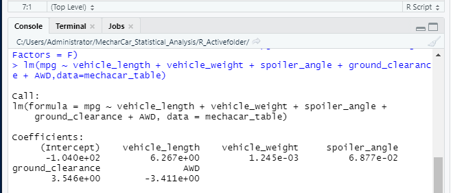
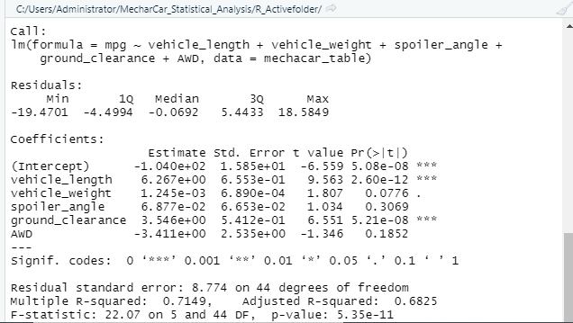
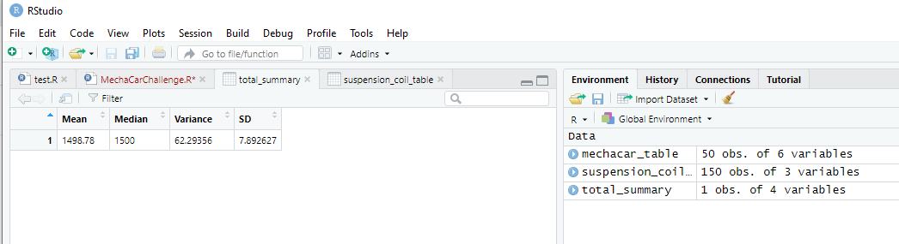
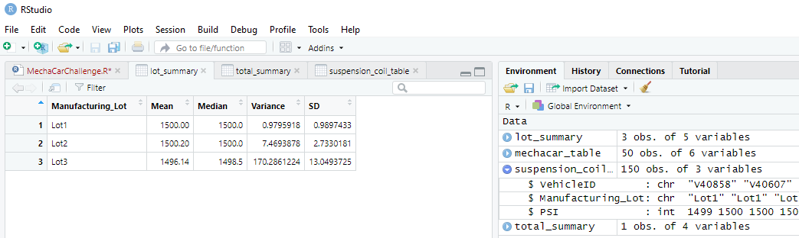
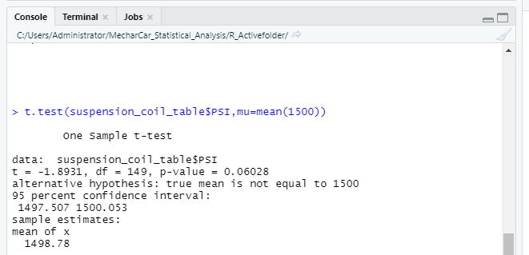
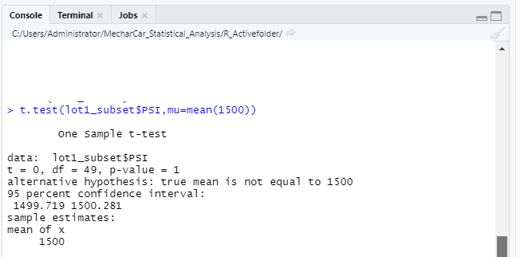
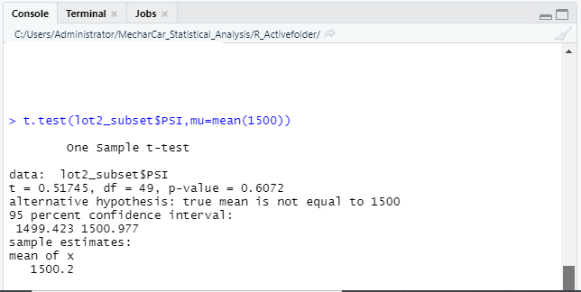
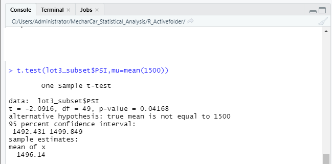

# MecharCar_Statistical_Analysis
The purpose of this analysis [See link to my R-Script here](R_Activefolder/MechaCarChallenge.R) is to;

- *Perform multiple linear regression analysis to identify which variables in the dataset predict the mpg of MechaCar prototypes*

- *Collect summary statistics on the pounds per square inch (PSI) of the suspension coils from the manufacturing lots*

- *Run t-tests to determine if the manufacturing lots are statistically different from the mean population*

- *Design a statistical study to compare vehicle performance of the MechaCar vehicles against vehicles from other manufacturers*

## Linear Regression to Predict MPG
The multiple linear regression utilizes multiple independent variables to account for part of the total variance observed in a dependent variable. Relating this to the case of the MechaCar protype, we are trying anayze and see if key independent variables such as vehicle length, vehicle weight, spoiler angle, ground clearance & AWD account for the the variance observed in MPG.

Assuming a significance value of 0.05, our linear regression will be designed to test the following hypothesis;
1. Ho (Null) = The slope of the linear model is zero i.e. m = 0
2. Ha (Alternative) = The slope of the linear model is not equal to zero i.e. m ≠ 0

The 2 images below show the result of the multiple linear regression & summary funtion respectively. 

 

 

Analyzing the above results, we can provide insights / answers to the following questions;

1. **Which variables/coefficients provided a non-random amount of variance to the mpg values in the dataset?** To determine which of the 5 independent variables that provided significant contribution to our linear model, we can look at the P-values of each individual independent variable in the summary function result displayed above and compare them to our selected significance value of 0.05%. From the result, we could see that both vehicle length and ground clearance (and by extension the intercept), whose values are well below our assumed significance value are statistically unlikely to provide random amounts of variance to our linear model. This means that vehicle length & ground clearance both have significant impact (i.e. both provide non-random amounts of variance) on the MPG values in our dataset. Despite this observation, it is also important to highlight that since the intercept is also statistically significant, it means that there are other variables & factors that have not been captured in our model which also influence the MPG values. 

2. **Is the slope of the linear model considered to be zero? Why or why not?** The slope of the linear model is not zero. This is because our analysis of the P-values of the independent variables in the summary function result above showed that there is a significant relationship between our MPG value and at least 2 (vehicle length & ground clearance) of the 5 independent variables. The slope of the linear model can only be considered to be zero when the dependent variable (MPG) is determined by random chance and error. 

3. **Does this linear model predict mpg of MechaCar prototypes effectively? Why or why not?** While the PR values of 2 (vehicle length & ground clearance) of the 5 independent variables were shown to have significant impact on the MPG values of our dataset, the linear model does not effectively predict the MPG of MechaCar prototypes. This is because the the P-value of the intercept in our model is also statistically significant. Where this is the case, we can imply that there are other variables and factors that contribute to the variation in MPG that have not been captured in our model. These factors may not be in our present dataset and as such should be collected and observed.

## Summary Statistics on Suspension Coils
The 2 images shown below detail the summary statistics (total summary & lot summary respectively) of the MechaCar Suspension Coils.

 
 
 
 

Analyzing the results displayed above to determine whether the current manufacturing data meet the design specification that the suspension coils must not exceed a variance of 100 pounds per square inch (i.e. standard deviation of 10), the following are my deductions;

1. **All Manufacturing Lots in Total** - From the result of the total_summary statistics, we can see that both the variance (62.29) and standard deviation (7.89) are well below the allowable variance (100) & by extension standard deviation (10) for the design specification of the suspension coils. So we can conclude on the basis of this data that in general / on the average, suspension coils manufactured in total meet the design specifications

2. **Lot 1 Summary Data**- From the review of Lot 1 summary data, we can see that both the variance (0.98) and standard deviation (0.99) are well below the allowable variance (100) & by extension standard deviation (10) for the design specification of the suspension coils. So we can conclude that on the basis of this data, suspension coils maufactured in Lot 1 meet the design specification.

3. **Lot 2 Summary Data** - From the review of Lot 2 summary data, we can see that both the variance (7.47) and standard deviation (2.43) are well below the allowable variance (100) & by extension standard deviation (10) for the design specification of the suspension coils. So we can conclude that on the basis of this data, suspension coils maufactured in Lot 2 meet the design specification.

4. **Lot 3 Summary Data** - From the review of Lot 3 summary data, we can see that both the variance (170.29) and standard deviation (13.05) are well above the allowable variance (100) & by extension standard deviation (10) for the design specification of the suspension coils. So we can conclude that on the basis of this data, suspension coils maufactured in Lot 3 do not meet the design specification.

## T-Tests on Suspension Coils
The following are my findings and interpretation of the results of the T-Tests that were conducted on the Suspension coils. We have also assumed a significance value of 0.05 as the benchmark for this test. In addition, our T-Test will be designed to the test the following hypothesis;

1. Ho (Null) = There is no statiscal difference between the observed sample mean (i.e manufacturing lots mean) and the presumed mean of the population
2. Ha (Alternative) = There is a statiscal difference between the observed sample mean and the presumed mean of the population

1. **T-Test Result of PSI Data Across all Manufacturing Lots** - From the review of the result shown in the image below, where the mean of the PSI datapoints across all manufaturing lots is compared against the given population mean of 1500, we can see that the P-value is 0.06 which is slightly above our selected significance value of 0.05. Therefore this means that we do not have sufficient evidence to reject our null hypothesis and we would conclude that the two means (mean from the PSI data across all the manufaturing lots & the population mean) are statistically similar.  

2. **T-Test Result of PSI Data From Manufacturing Lot 1** - From the review of the result shown in the image below, where the mean of PSI data of manufaturing lot 1 is compared against the given population mean of 1500, we can see that the P-value is 1 which is above our selected significance value of 0.05. Therefore this also means that we do not have sufficient evidence to reject our null hypothesis and we would conclude that the two means (mean from the PSI data manufaturing lot 1 & the population mean) are statistically similar.

3. **T-Test Result of PSI Data From Manufacturing Lot 2** - From the review of the result shown in the image below, where the mean of PSI data of manufaturing lot 2 is compared against the given population mean of 1500, we can see that the P-value is 0.61 which is above our selected significance value of 0.05. Therefore this also means that we do not have sufficient evidence to reject our null hypothesis and we would conclude that the two means (mean from the PSI data manufaturing lot 2 & the population mean) are statistically similar.

4. **T-Test Result of PSI Data From Manufacturing Lot 3** - From the review of the result shown in the image below, where the mean of PSI data of manufaturing lot 3 is compared against the given population mean of 1500, we can see that the P-value is 0.04 which is below our selected significance value of 0.05. Therefore this means that we have sufficient evidence to reject our null hypothesis and we would conclude that the two means (mean from the PSI data manufaturing lot 3 & the population mean) are statistically different.

## Study Design: MechaCar vs Competition
A sample statistical study that can be used to test / quantify how the MechaCars perform against competition is Chi-Squared Test. Chi-Squared Test can be used to compare the distribution of frequencies across two groups / categorical variables. Since in this case, our interest is to find out consumers preference of "Car Brands" (i.e. MechaCar Vs Competitor brands) using important consumer preferred vehicle metrics (such as purchase cost, maintenance cost, vehicle safety & fuel efficiency), the Chi-Squared test can be effectively used for this analysis. For the test, "Car Brands" will be in one category while the selected metric of choice will be in the second category. We can also assume significance value to be 0.05

1. **Metric to be Tested** - In my proposed study, the metric of choice that will be tested is maintenance cost. To me this metric will be high in the consumers metrics priority list because maintenance cost of a vechicle contribute significantly to the overall long term total cost of the vehicle. 

2. **Null & Alternative Hypothesis** - Since this is a Chi-Squared test, the hypothesis that will be tested are;

- Ho (Null) = There is no difference in the frequency distribution between both groups / categories i.e there is no association between car brand preference and maintenance cost.

- Ha (Alternative) = There is a difference in the frequency distribution between both groups / categories i.e there is association between car brand preference and maintenance cost.

3. **Statistical Test to be used for the study and why** - Again, as explained in the introductory paragraph above, I will be using the Chi-Squared Test. This is because Chi-Squared Test can be used to compare the distribution of frequencies across two groups / categorical variables. Since in this case, our interest is to find out consumers preference of "Car Brands" (i.e. MechaCar Vs Competitor brands - maybe against 3 other brands) using important consumer preferred vehicle metrics, the Chi-Squared test can be effectively used for this analysis. For the test, "Car Brands"- maybe 4 selected brands in total (inclusive of MechaCar) will be in one category while the selected metric of choice (amaintenance cost) will be in the second category.

4. **Data Required to Run the Test** - To generate the data required for the test, a representative random sampling approach of the car market can be used. A sample survey (using online questionnaire) of 400 consumers may be carried to generate the data required for this test. We can then proceed to use the count of respondents preferences per brand to populate our data table for the Chi-Squared test

These datasets from the respondents of the survey can then be used to generate a contingency table using R's table function following which we can then pass the contingency table to R's chisq.test() function to generate X-Squared Vlaue, DF (Degree of Freedom) and P-Value of the dataset. Where the P-Value is lower than our selected significance value, we will reject the null hypothesis and accept the alternative that there is an association between the consumers choice and maintenance cost. Where the P-Value is higher than the significance value, we will fail to reject the null hypothesis and conclude that 2 attributes are independent. 
